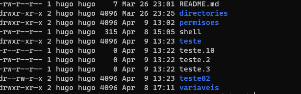

<h1>As permisões podem ser divididas em quatro partes para indicar: tipo, proprietario, grupo e outras permisões.</h1>

| Permissão | Binário | Decimal | Read "R" | Write "W" | Execute "X" 
|--- |--- |--- |--- |--- |--- 
| --- | 000 | 0 | ❌ | ❌ | ❌ |
| --x | 001 | 1 | ❌ | ❌ | ✔️ |
| -W- | 010 | 2 | ❌ | ✔️ | ❌ |
| -WX | 011 | 3 | ❌ | ✔️ | ✔️ | 
| r-- | 100 | 4 | ✔️ | ❌ | ❌ |
| r-x | 101 | 5 | ✔️ | ❌ | ✔️ | 
| rw- | 110 | 6 | ✔️ | ✔️ | ❌ |
| rwx | 111 | 7 | ✔️ | ✔️ | ✔️ |

---

| permisão | bi |
| --- | ---
--------- |	000
r--------	| 400
r--r--r--	| 444
rw-------	| 600
rw-r--r--	| 644
rw-rw-rw-	| 666
rwx------	| 700
rwxr-x---	| 750
rwxr-xr-x	| 755
rwxrwxrwx	| 777



String de 9 caracteres divididas em três grupos de três:
1 - proprietário <br>
2 - grupo  <br>
3 - outros  <br>
>ex:
```
-rw-r--r--
Um arquivo(-) no qual o proprietário pode ler e escrever mas não executar(RW-), o grupo pode ler mas não pode escrever ou executar, a mesma coisa para os outros(RW-).
```
>ex:
```
drwxr-xr-x
Diretório(d) no qual o proprietário pode ler, escrever e executar, o grupo pode ler e excutar, mas não pode escrever, a mesma coisa para os outros.
```

```
>Flag's
d => diretório;
b => arquivo de bloco; 
c => arquivo especial de caractere;
p => canal;
s => socker; 
- => arquivo "normal";
```

``` 
R => siginifica permissão de leitura (read); 
W => significa permissão de gravação (write); 
x => significa permissão de execução (execution); 
- => significa permissão desabilitada;
--- => nenhuma permissão; 
```
```
r-- => permissão de leitura; 
r-x => leitura e execução; 
rw- => leitura e gravação; 
rwx => leitura, gravação e execução.
```

>Símbolos
```
u => usuário
g => grupo
o=> outro
a => todos
```
```
+ (sinal de adição) => adicionar permissão
- (sinal de subtração) => remover permissão
= (sinal de igualdade) => definir permissão
```
EX: chmod u+w teste.old <br>
EX: chmod g+rw teste.old <br>
Ex: chmod g=rwx teste.old <Br>